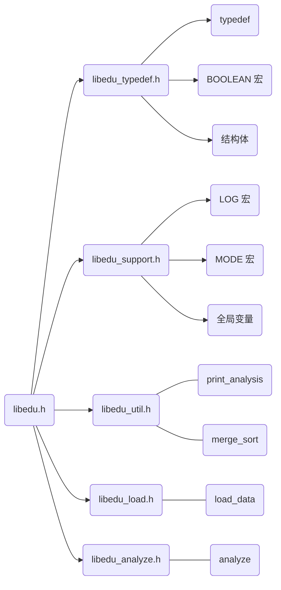

# libedu

## 结构图



## 主要类型定义及函数

### 类型定义

| 类型                | 别名         | 描述                                        |
| ------------------- | ------------ | ------------------------------------------- |
| `struct claz_s`     | `Claz`       | 储存班级信息                                |
| `struct course_s`   | `Course`     | 储存课程信息                                |
| `struct student_s`  | `Student`    | 储存学生信息                                |
| `void*`             | `analysis_p` | 用以指向 `Claz`、`Course`、`Student`        |
| `unsigned`          | `mode`       | 操作筛选项，指定函数的行为                  |
| `enum`              | `analysis_t` | 指定传入对象的类型（对象通过 `void*` 传入） |
| `struct analysis_s` | `analysis`   | 储存分析结果                                |

### 函数

| 返回值      | 函数名           | 描述                                                         |
| ----------- | ---------------- | ------------------------------------------------------------ |
| `void`      | `load_data`      | 通过传入的的文件名加载数据                                   |
| `analysis*` | `analyze`        | 分析数据，需要传入**对象**及其**类型**，并指定进行的**操作** |
| `void`      | `print_analysis` | 内置的格式化打印函数，传入 `analysis*`                       |

### 全局变量

| 类型及名称                      | 描述                                   |
| ------------------------------- | -------------------------------------- |
| `size_t claz_num`               | 班级数                                 |
| `size_t course_num`             | 课程数                                 |
| `size_t student_num`            | 学生数                                 |
| `Claz* pclaz`                   | 储存**班级**对象的**数组**，指向首地址 |
| `Course* pcourse`               | 储存**课程**对象的**数组**，指向首地址 |
| `Student* pstudent`             | 储存**学生**对象的**数组**，指向首地址 |
| `name_t* student_claz_buffer`   | 输入缓冲，不建议操作                   |
| `sid_t** student_course_buffer` | 输入缓冲，不建议操作                   |

### load_data

| 参数              | 描述                                       |
| ----------------- | ------------------------------------------ |
| `void`            | **返回值**                                 |
| `char * filename` | 数据文件路径，数据的结构详见“输入数据模板” |

使用示例：

```c
load_data("data.txt");
```

### analyze

| 参数                 | 描述                                                         |
| -------------------- | ------------------------------------------------------------ |
| `analysis*`          | **返回值**，指向分析结果结构体                               |
| `const analysis_t t` | 使用枚举指定第二个参数所指对象的类型<br />`ANA_CLAZ: Claz`<br />`ANA_COURSE: Course`<br />`ANA_STUDENT: Student` |
| `const analysis_p p` | 指向需要分析的对象（传入对象地址）                           |
| `mode ana_mode`      | 筛选需要分析的数据，具体值见文档“宏定义值——ana_mode”         |
| `mode ret_mode`      | 筛选需要返回的数据，具体值见文档“宏定义值——ret_mode”         |

使用示例：

```c
analysis* pana = analyze(ANA_CLAZ, &pclaz[0], _ANA_ALL_, _RET_ALL_);
```

### print_analysis

| 参数             | 描述               |
| ---------------- | ------------------ |
| `void`           | **返回值**         |
| `analysis* pana` | 指向分析结果结构体 |

使用示例：

```c
print_analysis(pana);
```

输出示例：

```
/**
 * pana 指向 Claz 对象的分析结果
 * 未要求返回的数据显示 not analyzed
 **/
============================  Claz  ============================

type: 0
Claz id: 2018260103

distribution:
2 3 2 1 1 0 

ranks:
NO.1 	201826010307
NO.2 	201826010309
NO.3 	201826010304
NO.4 	201826010301
NO.5 	201826010305
NO.6 	201826010308
NO.7 	201826010302
NO.8 	201826010306
NO.9 	201826010303

average score:
68.097778

fail rate:
0.222222

excellent rate:
not analyzed

============================  END  =============================
```

## 输入数据模板

```
claz_num
claz_id claz_name student_num
...

course_num
course_id course_name credit is_core student_num
...

student_num
student_id student_name claz_id course_num
course_id course_score
...

...
```

### 注释版

```
// 这是注释，只是在这里用来讲解，不应该出现在文件中
// 以空白符进行分隔，换行不影响读取
// 班级数（unsigned）
claz_num
// 班级编号（16 Byte） 班级名称（32 Byte) 班级内学生数
claz_id claz_name student_num
// 如果 claz_num > 1 则应当还有数据
...

// 课程数（unsigned）
course_num
// 课程编号（16 Byte） 课程名称（32 Byte) 学分数（unsigned） 是否为核心课程（int） 选课学生数
course_id course_name credit is_core student_num
// 如果 course_num > 1 则应当还有数据
...

// 学生数（unsigned）
student_num
// 学生学号 学生姓名 所属班级编号（16 Byte） 选课数（unsigned）
student_id student_name claz_id course_num
// 该学生选课的课程编号 课程分数
course_id course_score
// course_num > 1 则应当还有数据
...
// 此处输入完一个学生

// 以下当 student_num > 1 则应当还有数据
...
```

### 示例

```
2
2018260103 软件1803 1
2018260104 软件1804 1

2
Course_A Course_A 1 1 2
Course_B Course_B 4 1 1

2
201826010301 Student_A1 2018260103 2
Course_A 99.5
Course_B 45.6

201826010401 Student_B1 2018260103 1
Course_A 84.1
```

## 宏定义值

### ana_mode

```c
/**
 * define analyze mode
 * _ANA_ALL_        包含所有选项
 * _ANA_DEFAULT_    默认
 * _ANA_CORE_       只分析核心课程
 * _ANA_WEIGHT_     加权分析（计算学分）
 **/
#define _ANA_ALL_ 0xffffffff
#define _ANA_DEFAULT_ 0x0
#define _ANA_CORE_ 0x1
#define _ANA_WEIGHT_ 0x2
```

使用示例：

```c
mode claz_ana_mode = _ANA_CORE_ | _ANA_WEIGHT_;
```

### ret_mode

```c
/**
 * define return mode
 * _RET_ALL_        包含所有选项
 * _RET_DEFAULT_    默认
 **/
#define _RET_ALL_ 0xffffffff
#define _RET_DEFAULT_ 0xffffffff

/**
 * define claz mode
 * _RET_CLAZ_DEFAULT_       默认
 * _RET_CLAZ_DISTRIB_       返回 distribution
 * _RET_CLAZ_RANKS_         返回 ranks
 * _RET_CLAZ_AVER_SCORE_    返回 average score
 * _RET_CLAZ_FAIL_RATE_     返回 fail rate
 * _RET_CLAZ_EXC_RATE_      返回 excellent rate
 **/
#define _RET_CLAZ_DEFAULT_ 0xffffffff
#define _RET_CLAZ_DISTRIB_ 0x1
#define _RET_CLAZ_RANKS_ 0x2
#define _RET_CLAZ_AVER_SCORE_ 0x4
#define _RET_CLAZ_FAIL_RATE_ 0x8
#define _RET_CLAZ_EXC_RATE_ 0x10

/**
 * define course mode
 * _RET_COURSE_DEFAULT_       默认
 * _RET_COURSE_DISTRIB_       返回 distribution
 * _RET_COURSE_RANKS_         返回 ranks
 * _RET_COURSE_AVER_SCORE_    返回 average score
 * _RET_COURSE_FAIL_RATE_     返回 fail rate
 * _RET_COURSE_EXC_RATE_      返回 excellent rate
 **/
#define _RET_COURSE_DEFAULT_ 0xffffffff
#define _RET_COURSE_DISTRIB_ 0x1
#define _RET_COURSE_RANKS_ 0x2
#define _RET_COURSE_AVER_SCORE_ 0x4
#define _RET_COURSE_FAIL_RATE_ 0x8
#define _RET_COURSE_EXC_RATE_ 0x10

/**
 * define student mode
 * _RET_STUDENT_DEFAULT_    默认
 * _RET_STUDENT_DISTRIB_    返回 distribution
 * _RET_STUDENT_RANK_CLAZ_  返回 ranks in Claz
 * _RET_STUDENT_RANKS_      返回 ranks of all subjects
 * _RET_STUDENT_AVER_SCORE_ 返回 average score
 * _RET_STUDENT_HAS_FAIL_   返回 has fail
 **/
#define _RET_STUDENT_DEFAULT_ 0xffffffff
#define _RET_STUDENT_DISTRIB_ 0x1
#define _RET_STUDENT_RANK_CLAZ_ 0x2
#define _RET_STUDENT_RANKS_ 0x4
#define _RET_STUDENT_AVER_SCORE_ 0x8
#define _RET_STUDENT_HAS_FAIL_ 0x10
```

使用示例：

```c
mode claz_ret_mode = _RET_CLAZ_DISTRIB_ | _RET_CLAZ_AVER_SCORE_ | _RET_CLAZ_FAIL_RATE_;
```

## more

头文件内有详细注释，如果有疑惑可以前去查看。
